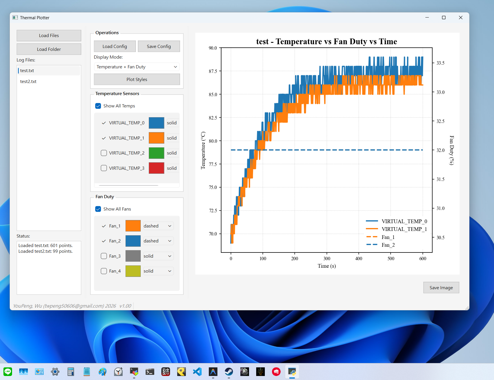

# ThermalPlot (Temperature/Duty Plotting Tool)

A Windows GUI tool for visualizing BMC temperature and fan duty data.

- **GUI Application**: Windows only
- **Data Collection Scripts**: Cross-platform (Windows/Linux via IPMI)

---

## 1. File Structure

```
ThermalPlot/
├── scripts/                # Recording and packaging scripts
│   ├── record_thermal.sh   # Linux recording script (requires ipmitool)
│   ├── record_thermal.bat  # Windows recording script (requires ipmitool)
│   ├── build_windows.bat   # Windows build script
│   └── run_app.bat         # Windows run script
├── config/                 # Configuration files
│   └── config.json         # Stores font sizes, colors, and UI settings
├── docs/                   # Documentation and assets
│   └── images/
│       └── tool_demo.png   # Tool demonstration screenshot
├── src/                    # Python source code
├── requirements.txt        # Python dependency list
└── README.md               # Documentation
```

---

## 2. Software Demonstration (Demo)



---

## 3. Data Recording

All recording scripts are located in the `scripts/` directory.
When executed, enter the duration for recording. The script will automatically generate a timestamped log file (`thermal_log_xxx.txt`).

### Configuration
Sensitive information is parameterized within the scripts. **Open the scripts in an editor before use** and fill in the following:
- `IPMI_HOST`, `IPMI_USER`, `IPMI_PASS`
- `IPMI_RAW_NETFN`, `IPMI_RAW_CMD`, `IPMI_RAW_DATA` (Used for fetching Fan Duty)

### Execution
*   **Linux**: `bash scripts/record_thermal.sh`
*   **Windows**: Double-click `scripts\record_thermal.bat`

---

## 4. Visualization Tool

Developed using Python (PyQt6 + Matplotlib).

### Environment Setup
If running for the first time or using source mode:

**Windows**:
*   Double-click `scripts\run_app.bat` (The script will automatically create a virtual environment).

### Key Features
1.  **Data Loading**: Supports single file or batch folder loading. Data is isolated by filename; simply click the list to switch between tests.
2.  **Right-Click Rename**: Right-click any file in the list to rename it directly (syncs with the file on disk).
3.  **Interactive Charts**: Hover over lines to view detailed values (Hover Tooltip).
4.  **Real-Time Customization**: Click "Plot Styles" to instantly adjust font sizes (Title, Axis, Ticks), line width, and **Legend Position (UR, UL, LR, LL)**.
5.  **View Modes**: Toggle between "Temp + Fan", "Temp Only", and "Fan Only" views.
6.  **Image Export**: Click "Save Image" to export the current plot as a high-resolution PNG.
7.  **Minimalist UI**: Professional "Industrial Gray" theme without unnecessary icons for a clean workspace.

---

## 5. Packaging (Executable)

Pack the application into a standalone `.exe` for environments without Python.

### Windows Packaging
1.  Double-click `scripts\build_windows.bat`.
2.  Output: `dist\ThermalPlot.exe`.

> [!IMPORTANT]
> To preserve your personal settings (colors, font sizes), remember to copy the `config/` folder to the same directory as the executable (`dist/`).

---

## Contact Information
**Author**: YouPeng, Wu (twpeng50606@gmail.com)
**Version**: v1.00
